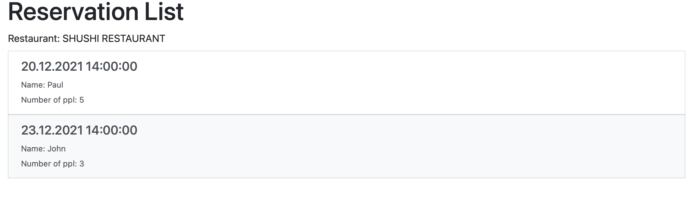
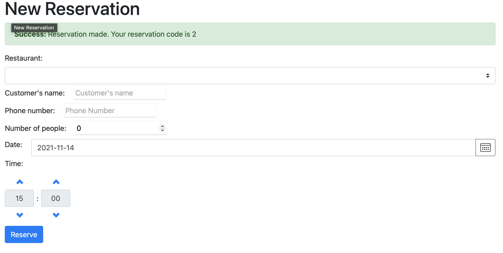

# angular-restaurant-reservation
## Summary
UI implemention of a restaurant reservation platform using Angular and bootstrap. Build and install the application using Docker.
This UI application works together with the [backend](https://github.com/kitshinghk-crypto/spring-boot-restaurant-reservation) module.

### To build the application:
```
docker-compose up
```
### Functionality:
- Make a reservation 
  - https://localhost/makeReservation
- List all reservation
  - https://localhost/listReservation/{restaurantId}

## Screenshot


